<div align="center">

# 🌾 Krushimandi - Agricultural Marketplace

### Connecting Farmers Directly with Buyers

A modern React Native application that eliminates middlemen by connecting farmers directly with buyers, enabling fresh produce trading with real-time communication and smart logistics.

[](https://reactnative.dev/)
[](https://www.typescriptlang.org/)
[](https://play.google.com/store/apps/details?id=com.krushimandi.app)
[](https://www.apple.com/ios)
[](https://firebase.google.com/)

### 📲 Download Now

<a href="https://play.google.com/store/apps/details?id=com.krushimandi.app">
  
</a>

[**🌐 Visit Play Store**](https://play.google.com/store/apps/details?id=com.krushimandi.app)

---

</div>

## 📱 About

Krushimandi is an innovative agricultural marketplace that eliminates middlemen by connecting farmers directly with buyers. The platform enables fresh produce trading with features like real-time chat, order tracking, and intelligent market insights.

### 🏆 Now Available on Google Play Store!

Experience seamless agricultural trading directly from your Android device. Download now from the [**Google Play Store**](https://play.google.com/store/apps/details?id=com.krushimandi.app).

## 📸 Screenshots

<div align="center">

### Experience the App in Action

<style>
  .screenshot-table img {
    width: 250px;
    height: 500px;
    object-fit: cover;
    border-radius: 8px;
  }
</style>

<div class="screenshot-table">

#### 🏠 Home & Navigation
| Language Selection | Location Detection | Browse Products |
|-------------------|-------------------|-----------------|
| 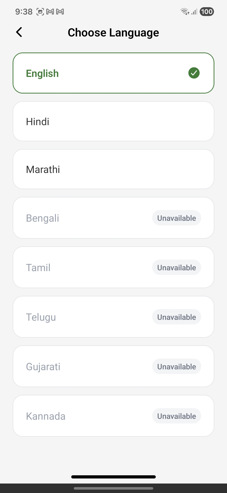 | 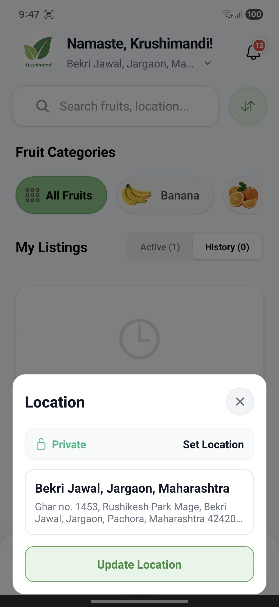 | 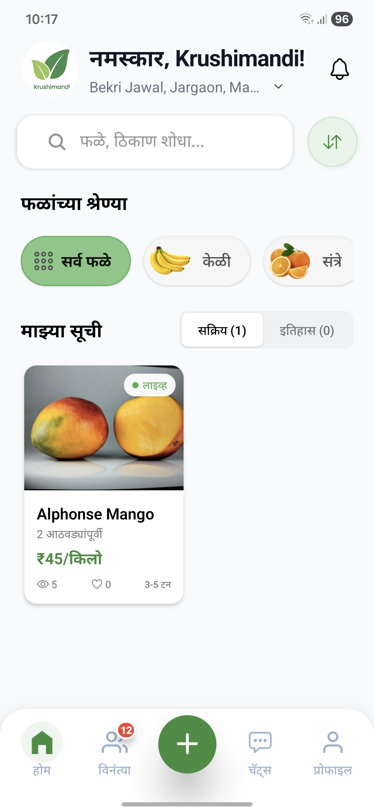 |

#### 🌾 Farmer Features
| Add Product | Product Details | Farmer Requests |
|------------|----------------|----------------|
| 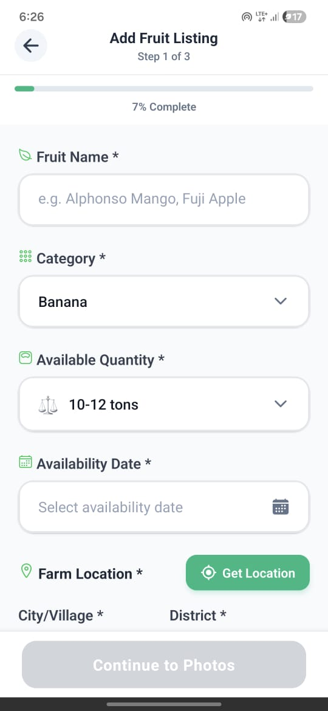 | 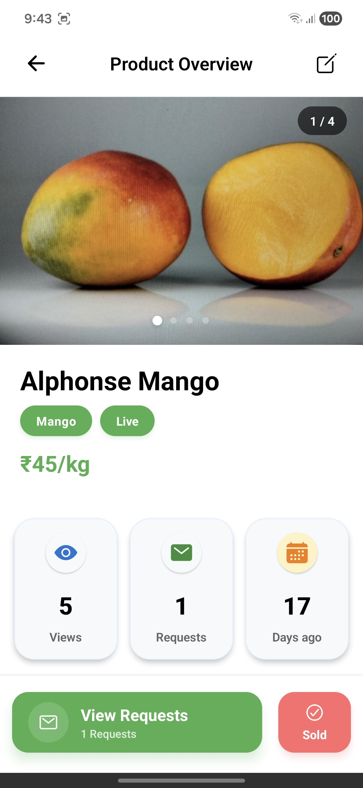 | 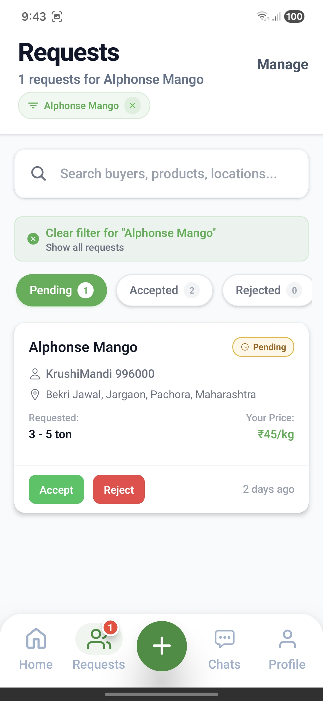 |

#### 🛒 Buyer Features
| Product Details | Review System | Buyer Profile |
|----------------|--------------|--------------|
| 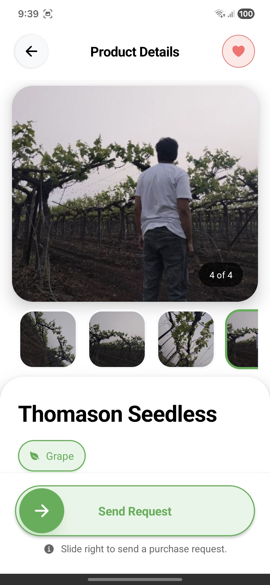 | 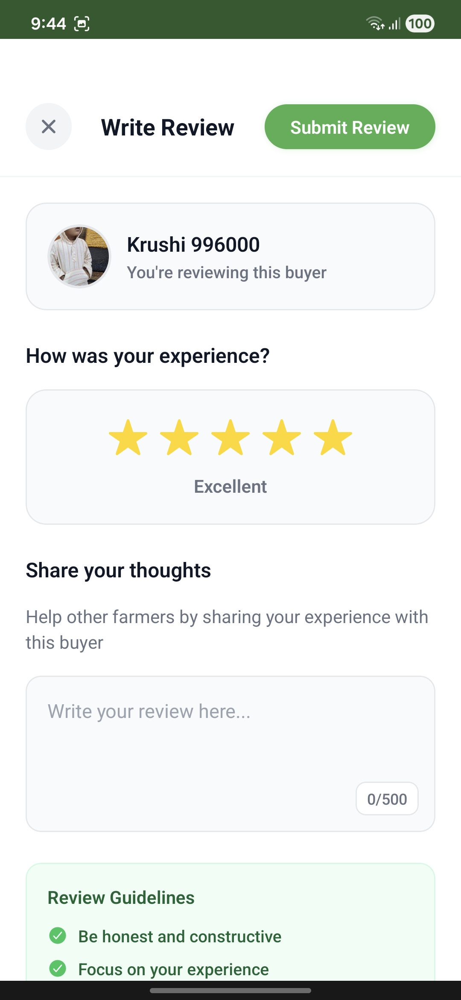 | 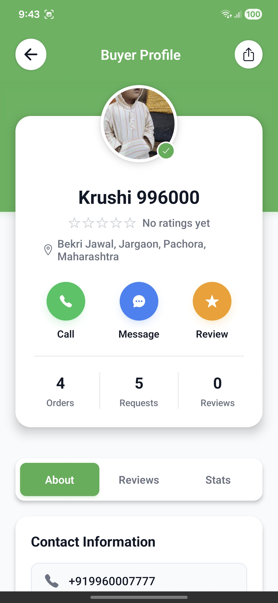 |

#### 💬 Communication & Smart Features
| Real-time Chat | AI Fruit Suggestions | User Feedback |
|---------------|---------------------|---------------|
| 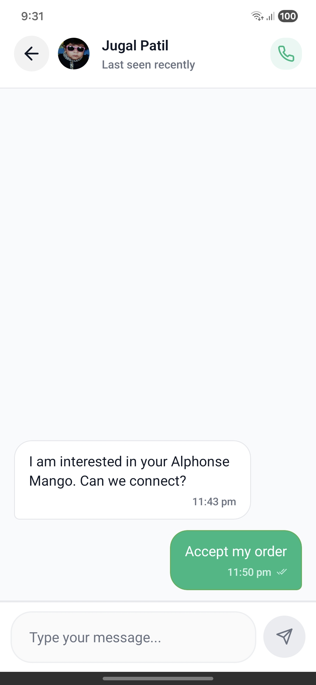 | 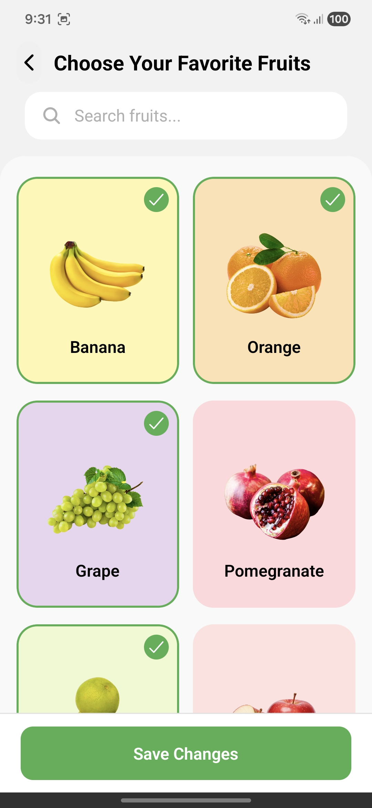 | 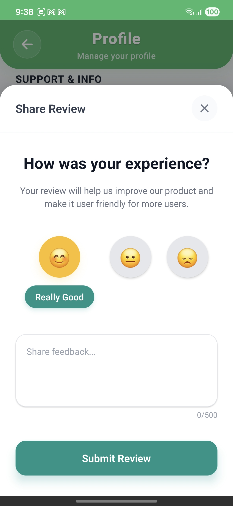 |

</div>

</div>

---

## 🎯 Key Features

<table>
<tr>
<td width="50%" valign="top">

### 👨‍🌾 For Farmers

- 📦 **Product Listing Management**
  - Upload multiple product images
  - Detailed descriptions with pricing
  - Manage product status (Active, Pending, Sold, Expired)
  
- 📊 **Real-time Order Management**
  - Track inquiries and sales
  - Delivery status tracking
  - Order history and analytics

- 💬 **Direct Communication**
  - Chat directly with buyers
  - Real-time messaging
  - Share product updates

- 📈 **Sales Analytics**
  - Revenue tracking
  - Performance insights
  - Sales history reports

- 🔔 **Smart Notifications**
  - New order alerts
  - Message notifications
  - Status updates

</td>
<td width="50%" valign="top">

### 🛒 For Buyers

- 🔍 **Product Discovery**
  - Browse fresh produce
  - Detailed farmer profiles
  - Product quality ratings

- 🎯 **Advanced Search & Filters**
  - Filter by location
  - Price range selection
  - Quality and variety filters
  - Sorting options

- 📦 **Order Management**
  - Easy checkout process
  - Track orders in real-time
  - Order history

- ⭐ **Review System**
  - Rate farmers and products
  - Read buyer reviews
  - Build trust through feedback

- 💳 **Secure Payments**
  - Multiple payment options
  - Transaction security
  - Payment history

</td>
</tr>
</table>

### 🚀 Smart Features

- 🎨 **Role-based Navigation** - Adaptive UI based on user type (Farmer/Buyer)
- 📍 **Location-based Services** - Auto-detect location with GPS for accurate address filling
- 🔔 **Real-time Notifications** - Push notifications for orders, messages, and updates via FCM
- 🌐 **Multi-language Support** - Accessible in Hindi and English
- 📱 **Over-the-Air Updates** - Seamless app updates using Stallion OTA
- 🌙 **Offline Capability** - Core features work without internet connection
- 🔒 **Secure Authentication** - Firebase Authentication with phone number verification
- 📸 **Image Management** - Multiple image upload with compression and optimization

## 🏗️ Tech Stack

<div align="center">

### Built with Modern Technologies

</div>

<table>
<tr>
<td width="33%" valign="top">

### 📱 Frontend

- **React Native CLI** 0.72+
  - Native mobile development
  - Type-safe with TypeScript
  
- **React Navigation 7**
  - Stack, Tab, Drawer navigation
  - Deep linking support
  
- **NativeWind + TailwindCSS**
  - Utility-first styling
  - Responsive design
  
- **React Native Reanimated**
  - High-performance animations
  - Smooth transitions
  
- **React Native Vector Icons**
  - Icon library
  - Custom icon support
  
- **React Native Image Picker**
  - Camera & gallery access
  - Image compression

</td>
<td width="33%" valign="top">

### 🔧 State & Storage

- **Zustand**
  - Lightweight state management
  - Simple and scalable
  
- **AsyncStorage**
  - Local data persistence
  - Offline data caching
  
- **React Context API**
  - Theme management
  - Authentication context
  
- **Custom Hooks**
  - Reusable logic
  - Clean code structure

### 🔔 Notifications

- **@notifee/react-native**
  - Local notifications
  - Custom notification UI
  
- **Firebase Cloud Messaging**
  - Push notifications
  - Real-time messaging

</td>
<td width="33%" valign="top">

### ☁️ Backend & Services

- **Firebase Suite**
  - 🔥 **Firestore** - NoSQL database
  - 🔐 **Authentication** - Phone auth
  - 📦 **Storage** - File storage
  - 💬 **FCM** - Push notifications
  - 📊 **Analytics** - User insights
  
- **Location Services**
  - 📍 GPS auto-detection
  - 🗺️ Google Geocoding API
  - 📡 React Native Geolocation
  
- **Device Features**
  - 📱 React Native Device Info
  - 🌐 React Native NetInfo
  - 🔒 React Native Permissions
  
- **OTA Updates**
  - 🔄 Stallion React Native
  - Silent auto-updates

</td>
</tr>
</table>

<div align="center">

### 🎨 UI/UX Excellence

**Responsive Design** • **Dark Mode Support** • **Haptic Feedback** • **Smooth Animations** • **Intuitive Navigation**

</div>

## 📂 Project Structure

```
src/
├── assets/               # Images, fonts, and static files
├── components/           # Reusable UI components
│   ├── auth/             # Authentication screens
│   ├── common/           # Shared components
│   ├── home/             # Home screen components
│   ├── notification/     # Notification components
│   ├── orders/           # Order management components
│   ├── products/         # Product-related components
│   ├── profile/          # User profile components
│   └── ...               # Other component groups
├── config/               # Firebase and other configurations
├── constants/            # App-wide constants (colors, styles)
├── contexts/             # React context providers
├── hooks/                # Custom hooks for reusable logic
├── navigation/           # Navigation setup and stacks
│   ├── auth/             # Auth navigation flow
│   ├── buyer/            # Buyer-specific navigation
│   ├── farmer/           # Farmer-specific navigation
│   └── ...               # Other navigation stacks
├── services/             # Services for API calls and backend logic
├── store/                # Zustand stores for state management
├── types/                # TypeScript type definitions
├── ui/                   # General UI elements
└── utils/                # Utility functions
```

## 🚀 Getting Started

### ⚡ Quick Start

```bash
# Clone the repository
git clone https://github.com/Krushimandi/Krushimandi-app.git
cd Krushimandi-app

# Install dependencies
npm install

# Install iOS dependencies (macOS only)
cd ios && pod install && cd ..

# Run on Android
npm run android

# Run on iOS (macOS only)
npm run ios
```

### 📋 Prerequisites

<table>
<tr>
<td width="50%">

#### 🖥️ Development Environment

- **Node.js** v18 or higher
- **npm** or **yarn** package manager
- **React Native CLI** 
  ```bash
  npm install -g @react-native-community/cli
  ```
- **Git** for version control

</td>
<td width="50%">

#### 📱 Platform Requirements

**For Android:**
- Android Studio (latest version)
- Java Development Kit (JDK 11+)
- Android SDK (API level 31+)

**For iOS (macOS only):**
- Xcode 14 or higher
- CocoaPods
- Xcode Command Line Tools

</td>
</tr>
</table>

### Development Environment Setup

#### Android Setup
1. **Install Android Studio**
2. **Configure Android SDK** (API level 31 or higher)
3. **Set up Android Virtual Device (AVD)**
4. **Add Android SDK to PATH**:
   ```bash
   export ANDROID_HOME=$HOME/Library/Android/sdk
   export PATH=$PATH:$ANDROID_HOME/emulator
   export PATH=$PATH:$ANDROID_HOME/tools
   export PATH=$PATH:$ANDROID_HOME/tools/bin
   export PATH=$PATH:$ANDROID_HOME/platform-tools
   ```

#### iOS Setup (macOS only)
1. **Install Xcode** (from Mac App Store)
2. **Install Xcode Command Line Tools**:
   ```bash
   xcode-select --install
   ```
3. **Install CocoaPods**:
   ```bash
   sudo gem install cocoapods
   ```

### Installation

1. **Clone the repository**
   ```bash
   git clone https://github.com/yourusername/Krushimandi.git
   cd Krushimandi
   ```

2. **Install dependencies**
   ```bash
   npm install
   # or
   yarn install
   ```

3. **Install iOS dependencies** (iOS only)
   ```bash
   cd ios && pod install && cd ..
   ```

4. **Set up environment variables**
   ```bash
   cp .env.example .env
   ```
   Then, edit the `.env` file with your configuration.

### Running the App

#### Start Metro Bundler
```bash
npx react-native start
# or
yarn start
```

#### Run on Android
```bash
# Make sure you have an Android emulator running or device connected
npx react-native run-android
# or
yarn android
```

#### Run on iOS (macOS only)
```bash
# Make sure you have an iOS simulator running or device connected
npx react-native run-ios
# or
yarn ios

# Run on specific iOS device
npx react-native run-ios --device "Device Name"
```

### Debugging

#### React Native Debugger
```bash
# Install React Native Debugger
brew install --cask react-native-debugger

# Enable debugging in app (Cmd+D on iOS, Cmd+M on Android)
# Select "Debug JS Remotely"
```

#### Flipper Integration
```bash
# Install Flipper
brew install --cask flipper

# Flipper plugins are already configured in the project
```

## 🔧 Configuration

### Environment Variables

Create a `.env` file in the root directory:

```env
# API Configuration
API_BASE_URL=https://your-api-endpoint.com
API_KEY=your-api-key

# Authentication
GOOGLE_OAUTH_CLIENT_ID=your-google-client-id
FACEBOOK_APP_ID=your-facebook-app-id

# Maps & Location
GOOGLE_MAPS_API_KEY=your-google-maps-key
GOOGLE_GEOCODING_API_KEY=your-google-geocoding-key  # For accurate address resolution

# Push Notifications
FCM_SERVER_KEY=your-fcm-server-key

# Payment Gateway
RAZORPAY_KEY_ID=your-razorpay-key
STRIPE_PUBLISHABLE_KEY=your-stripe-key
```

### Android Configuration

#### 1. Google Services Setup
```bash
# Add google-services.json to android/app/
# Get this file from Firebase Console
```

#### 2. Signing Configuration
```gradle
// android/app/build.gradle
android {
    ...
    signingConfigs {
        debug {
            storeFile file('debug.keystore')
            storePassword 'android'
            keyAlias 'androiddebugkey'
            keyPassword 'android'
        }
        release {
            if (project.hasProperty('Krushimandi_UPLOAD_STORE_FILE')) {
                storeFile file(Krushimandi_UPLOAD_STORE_FILE)
                storePassword Krushimandi_UPLOAD_STORE_PASSWORD
                keyAlias Krushimandi_UPLOAD_KEY_ALIAS
                keyPassword Krushimandi_UPLOAD_KEY_PASSWORD
            }
        }
    }
}
```

#### 3. Permissions
```xml
<!-- android/app/src/main/AndroidManifest.xml -->
<uses-permission android:name="android.permission.INTERNET" />
<uses-permission android:name="android.permission.CAMERA" />
<uses-permission android:name="android.permission.ACCESS_FINE_LOCATION" />
<uses-permission android:name="android.permission.ACCESS_COARSE_LOCATION" />
<uses-permission android:name="android.permission.VIBRATE" />
<uses-permission android:name="android.permission.POST_NOTIFICATIONS" />
```

### iOS Configuration

#### 1. Bundle Identifier
```bash
# Update bundle identifier in ios/Krushimandi.xcodeproj
# Format: com.yourcompany.Krushimandi
```

#### 2. Info.plist Permissions
```xml
<!-- ios/Krushimandi/Info.plist -->
<key>NSCameraUsageDescription</key>
<string>This app needs access to camera to take product photos</string>
<key>NSPhotoLibraryUsageDescription</key>
<string>This app needs access to photo library to select product images</string>
<key>NSLocationWhenInUseUsageDescription</key>
<string>This app needs location access to auto-fill your farm location details when listing fruits. This helps buyers find your products and improves the accuracy of your listings.</string>
<key>NSLocationAlwaysAndWhenInUseUsageDescription</key>
<string>This app needs location access to auto-fill your farm location details when listing fruits. This helps buyers find your products and improves the accuracy of your listings.</string>
<key>NSLocationUsageDescription</key>
<string>This app needs location access to auto-fill your farm location details when listing fruits.</string>
```

## 🧪 Testing

### Running Tests
```bash
# Unit tests with Jest
npm test
# or
yarn test

# Run tests in watch mode
npm test -- --watch
# or
yarn test --watch
```

### E2E Testing with Detox
```bash
# Install Detox CLI
npm install -g detox-cli

# Build the app for testing
detox build --configuration ios.sim.debug

# Run E2E tests
detox test --configuration ios.sim.debug
```

### Code Quality
```bash
# ESLint
npm run lint
# or
yarn lint

# TypeScript type checking
npm run type-check
# or
yarn type-check
```

## 📦 Building for Production

### Android Release Build

#### 1. Generate Release APK
```bash
cd android
./gradlew assembleRelease
# APK will be generated at: android/app/build/outputs/apk/release/app-release.apk
```

#### 2. Generate Android App Bundle (AAB)
```bash
cd android
./gradlew bundleRelease
# AAB will be generated at: android/app/build/outputs/bundle/release/app-release.aab
```

### iOS Release Build

#### 1. Archive in Xcode
```bash
# Open iOS project in Xcode
open ios/Krushimandi.xcworkspace

# In Xcode:
# 1. Select "Any iOS Device" or your device
# 2. Product > Archive
# 3. Follow the wizard to upload to App Store Connect
```

#### 2. Command Line Build
```bash
# Build for release
npx react-native run-ios --configuration Release
```

## 🔧 Troubleshooting

### Common Issues

#### Metro Bundler Issues
```bash
# Clear Metro cache
npx react-native start --reset-cache

# Clear node modules and reinstall
rm -rf node_modules && npm install
```

#### Android Build Issues
```bash
# Clean Android build
cd android && ./gradlew clean && cd ..

# Reset Metro and Android
npx react-native start --reset-cache
npx react-native run-android
```

#### iOS Build Issues
```bash
# Clean iOS build
cd ios && xcodebuild clean && cd ..

# Reinstall iOS dependencies
cd ios && pod deintegrate && pod install && cd ..
```

#### Permission Issues
```bash
# Fix file permissions
chmod +x android/gradlew
```

## 🤝 Contributing

We welcome contributions! Please follow these steps:

1. **Fork the repository**
2. **Create a feature branch**
   ```bash
   git checkout -b feature/amazing-feature
   ```
3. **Commit your changes**
   ```bash
   git commit -m 'Add some amazing feature'
   ```
4. **Push to the branch**
   ```bash
   git push origin feature/amazing-feature
   ```
5. **Open a Pull Request**

### Development Guidelines

- Follow **TypeScript** best practices
- Use **ESLint** and **Prettier** for code formatting
- Write **unit tests** for new features
- Test on both **iOS and Android**
- Update documentation for significant changes
- Follow **conventional commit** messages

## 🎯 Features Status

<div align="center">

### ✅ What's Available Now

</div>

<table>
<tr>
<td width="50%" valign="top">

#### 🟢 Core Features (Live)

- ✅ User authentication with phone number
- ✅ Role-based navigation (Farmer/Buyer)
- ✅ Product listing with multiple images
- ✅ Advanced search and filtering
- ✅ Real-time chat messaging
- ✅ Order management system
- ✅ Push notifications (FCM + Notifee)
- ✅ Location-based services with GPS
- ✅ Profile management
- ✅ Wishlist functionality
- ✅ Review and rating system
- ✅ Multi-language support (Hindi/English)
- ✅ Over-the-air (OTA) updates
- ✅ Offline mode support
- ✅ Image upload and compression
- ✅ Badge notifications for unseen items

</td>
<td width="50%" valign="top">

#### 🔄 Coming Soon

- 🔜 Payment gateway integration
- 🔜 Delivery tracking with live GPS
- 🔜 AI-powered price recommendations
- 🔜 Weather integration for farmers
- 🔜 Bulk order management
- 🔜 Advanced analytics dashboard
- 🔜 Verified farmer badges
- 🔜 Product quality certification
- 🔜 Seasonal demand forecasting
- 🔜 Contract farming support

#### 🔮 Future Vision

- 📱 Web admin panel
- 🤖 Machine learning insights
- 🔗 Blockchain for transparency
- 🌐 API for third-party integrations
- 📊 IoT integration for smart farming
- 🚚 Logistics partner integration

</td>
</tr>
</table>

---

## 📊 App Statistics

<div align="center">

| Metric | Value |
|--------|-------|
| 📱 **Platform** | Android (Google Play) |
| 🚀 **Version** | 1.0.0+ |
| 📦 **Package** | `com.krushimandi.app` |
| 🌐 **Languages** | Hindi, English |
| 📊 **Min SDK** | Android 6.0+ (API 23) |
| 🎯 **Target SDK** | Android 13+ (API 33) |
| 📦 **App Size** | ~50 MB |
| ⚡ **Performance** | 60 FPS |

</div>

## 📄 License

This project is licensed under the **MIT License** - see the [LICENSE](LICENSE) file for details.

## 💡 Use Cases

<table>
<tr>
<td width="50%" valign="top">

### 👨‍🌾 Farmer Journey

1. **Sign Up** - Register with phone number
2. **List Products** - Upload fruits with photos and details
3. **Get Orders** - Receive buyer inquiries
4. **Chat & Negotiate** - Discuss prices and delivery
5. **Track Sales** - Monitor orders and revenue
6. **Build Reputation** - Earn ratings and reviews

</td>
<td width="50%" valign="top">

### 🛒 Buyer Journey

1. **Browse** - Explore fresh produce
2. **Filter** - Find products by location, price, quality
3. **View Details** - Check farmer profile and ratings
4. **Chat** - Ask questions and negotiate
5. **Place Order** - Request products
6. **Track** - Monitor order status

</td>
</tr>
</table>

---

## 🤝 Contributing

We welcome contributions from the community! Here's how you can help:

<table>
<tr>
<td width="33%">

### 🐛 Report Bugs
Found a bug? [Open an issue](https://github.com/Krushimandi/Krushimandi-app/issues) with:
- Clear description
- Steps to reproduce
- Screenshots if applicable

</td>
<td width="33%">

### 💡 Suggest Features
Have an idea? [Create a feature request](https://github.com/Krushimandi/Krushimandi-app/issues) with:
- Use case description
- Expected behavior
- Benefits for users

</td>
<td width="33%">

### 🔧 Submit PR
Want to contribute code?
1. Fork the repository
2. Create feature branch
3. Make changes
4. Submit pull request

</td>
</tr>
</table>

### Development Guidelines

```bash
# Fork and clone
git clone https://github.com/your-username/Krushimandi-app.git

# Create feature branch
git checkout -b feature/amazing-feature

# Make changes and commit
git commit -m 'Add some amazing feature'

# Push and create PR
git push origin feature/amazing-feature
```

**Code Standards:**
- ✅ Follow TypeScript best practices
- ✅ Use ESLint and Prettier
- ✅ Write unit tests for new features
- ✅ Test on both iOS and Android
- ✅ Update documentation
- ✅ Follow conventional commits

---

## 📞 Support & Contact

<div align="center">

### 🆘 Get Help

<table>
<tr>
<td align="center">

### 📧 Email
[krushimandiofficial@gmail.com](mailto:krushimandiofficial@gmail.com)

</td>
<td align="center">

### 🐛 Report Issues
[GitHub Issues](https://github.com/Krushimandi/Krushimandi-app/issues)

</td>
<td align="center">

### 📱 Play Store
[Download App](https://play.google.com/store/apps/details?id=com.krushimandi.app)

</td>
</tr>
</table>

</div>

### ❓ Frequently Asked Questions

<details>
<summary><b>Why React Native CLI instead of Expo?</b></summary>

React Native CLI provides full control over native code, custom native modules, and better performance optimization for our agricultural marketplace features. We need direct access to native APIs for features like OTA updates, advanced notifications, and GPS services.

</details>

<details>
<summary><b>Do I need both Android Studio and Xcode?</b></summary>

You only need the development environment for the platform you're targeting. If you're only developing for Android, Android Studio is sufficient. For iOS development, Xcode (macOS only) is required. For full development, both are recommended.

</details>

<details>
<summary><b>How do I run on a physical device?</b></summary>

**Android:** Enable Developer Options and USB Debugging on your device, then connect via USB and run `npm run android`.

**iOS:** Register your device with Apple Developer Program, add it in Xcode, and run `npm run ios --device "Your Device Name"`.

</details>

<details>
<summary><b>The app crashes on startup, what should I do?</b></summary>

1. Check Metro bundler logs for errors
2. Ensure all dependencies are installed: `npm install`
3. Clear build cache: `npm start -- --reset-cache`
4. Clean and rebuild: `cd android && ./gradlew clean && cd ..`
5. Check if you've added Firebase configuration files

</details>

<details>
<summary><b>How do I update the app with new changes?</b></summary>

The app uses Stallion OTA (Over-The-Air) updates for seamless updates. Users automatically receive updates when they launch the app, without needing to download from Play Store (for JavaScript changes). For native code changes, a new Play Store release is required.

</details>

<details>
<summary><b>Is this app available on iOS?</b></summary>

Currently, Krushimandi is available on Android via Google Play Store. iOS development is in our roadmap and will be available soon on the Apple App Store.

</details>

---

## 👥 Team

<div align="center">

**Built with ❤️ by the Krushimandi Team**

Dedicated to empowering farmers and revolutionizing agricultural commerce in India.

</div>

---

## 📄 License

This project is licensed under the **MIT License** - see the [LICENSE](LICENSE) file for details.

```
MIT License

Copyright (c) 2024 Krushimandi

Permission is hereby granted, free of charge, to any person obtaining a copy
of this software and associated documentation files (the "Software"), to deal
in the Software without restriction, including without limitation the rights
to use, copy, modify, merge, publish, distribute, sublicense, and/or sell
copies of the Software, and to permit persons to whom the Software is
furnished to do so, subject to the following conditions:

The above copyright notice and this permission notice shall be included in all
copies or substantial portions of the Software.
```

---

<div align="center">

## 🌟 Show Your Support

If you like this project, please consider giving it a ⭐ on GitHub!

[](https://github.com/Krushimandi/Krushimandi-app)
[](https://github.com/Krushimandi/Krushimandi-app/fork)
[](https://github.com/Krushimandi/Krushimandi-app)

### 📲 Download from Play Store

<a href="https://play.google.com/store/apps/details?id=com.krushimandi.app">
  
</a>

---

**Connect Farmers • Empower Agriculture • Transform India**

[⭐ Star](https://github.com/Krushimandi/Krushimandi-app) • [🍴 Fork](https://github.com/Krushimandi/Krushimandi-app/fork) • [🐛 Report Bug](https://github.com/Krushimandi/Krushimandi-app/issues) • [💡 Request Feature](https://github.com/Krushimandi/Krushimandi-app/issues)

Made with 💚 for Indian Agriculture

</div>